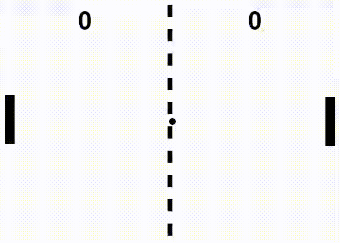

# Pong Reinforcement Learning Agent

A complete implementation of a Pong-playing AI agent using Proximal Policy Optimization (PPO), Pygame and OpenAI Gymnasium. The agent learns to play Pong from scratch through self-play against a rule-based opponent.

## Project Overview

This project demonstrates end-to-end reinforcement learning development, from environment creation to agent training and evaluation. The AI agent learns to play Pong using only sparse rewards (+1 for scoring, -1 for opponent scoring) and develops sophisticated gameplay strategies through trial and error.

## Game Rules

The goal of the game is simple just defend the pong ball and you get a score if the other player misses.
First to 5 points wins the game.

## Demo 
The left paddle is the Agent and the right paddle is a rule-based AI.


### Key Features
- Custom Gym environment with proper observation/action spaces
- PPO-based training with Stable-Baselines3
- Visual gameplay recording for demonstrations
- Increasing ball speed mechanics for dynamic gameplay
- Comprehensive training monitoring and evaluation

## Quick Start

### Prerequisites
```bash
pip install gymnasium pygame stable-baselines3 opencv-python numpy
```

### Training the Agent
```bash
# Quick training demo (50k timesteps, ~5 minutes)
python pong_rl_training.py
# Choose option 2 for quick demo

# Full training (500k timesteps, ~30 minutes)  
python pong_rl_training.py
# Choose option 1 for complete training
```

### Watch Trained Agent
```bash
python pong_rl_training.py
# Choose option 3 to watch best model play
```

### Record Demo Video
```bash
python pong_record.py
# Creates 30-second MP4 demo video
```

## Technical Implementation

### Environment Design
- **State Space**: 6-dimensional normalized vector
  - Ball position (x, y)  
  - Ball velocity (x, y)
  - Agent paddle position
  - Opponent paddle position
- **Action Space**: Discrete(3) - Stay, Move Up, Move Down
- **Reward Structure**: Sparse rewards (+1 scoring, -1 opponent scoring)

### Algorithm: PPO (Proximal Policy Optimization)
- **Policy Network**: Multi-layer perceptron outputting action probabilities
- **Value Network**: Critic network for advantage estimation
- **Key Parameters**:
  - Learning rate: 3e-4
  - Batch size: 64
  - Clip range: 0.2
  - 4 parallel environments for faster training

### Game Mechanics
- **Dynamic difficulty**: Ball speed increases 5% after each paddle hit
- **Physics simulation**: Realistic ball bouncing with angle variation
- **Opponent AI**: Rule-based player with reaction delays and prediction errors

## Training Results

The agent demonstrates clear learning progression:

- **Early Training (0-50k steps)**: Random movement, rarely hits ball
- **Mid Training (50k-200k steps)**: Basic ball tracking, occasional rallies
- **Late Training (200k+ steps)**: Sophisticated positioning, consistent wins

**Final Performance**: 
- Win rate vs rule-based opponent: ~70-80%
- Average rally length: 15+ hits
- Adaptation to increasing ball speeds

## Project Structure

```
pong-rl/
├── pong_gym_environment.py          # Custom Gymnasium environment
├── pong_rl_training.py        # Training script with PPO
├── pong_record.py       # Gameplay recording utility
├── models/              # Saved model checkpoints
├── logs/                # Training logs and metrics
├── pong_demo.mp4        # Demo video
└── README.md
```

##  Key Technical Challenges Solved

### 1. Sparse Reward Learning
The agent receives feedback only when points are scored, making initial learning difficult. PPO's actor-critic architecture helps by learning state values to provide denser learning signals.

### 2. Real-time Decision Making  
Unlike turn-based games, Pong requires continuous decision-making at 60 FPS. The agent learns to predict ball trajectories and position accordingly.

### 3. Opponent Adaptation
The rule-based opponent includes realistic limitations (reaction time, prediction errors) to prevent the agent from learning exploitative strategies that wouldn't work against human players.

### 4. Dynamic Game Conditions
Increasing ball speed throughout rallies requires the agent to adapt its strategy in real-time, demonstrating robust learning.

## Game Features

- **Visual Rendering**: Real-time pygame visualization
- **Score Tracking**: Automatic game state management
- **Collision Physics**: Realistic ball-paddle interactions
- **Speed Ramping**: Progressive difficulty increase
- **Demo Recording**: High-quality video output for presentations

## Monitoring and Evaluation

### TensorBoard Integration
```bash
tensorboard --logdir logs/
# View training metrics at http://localhost:6006
```

### Evaluation Metrics
- Episode rewards over time
- Win/loss ratios
- Policy entropy (exploration vs exploitation)
- Value function accuracy

## Customization Options

### Adjust Training Parameters
```python
# In pong_rl_training.py
model = PPO(
    learning_rate=3e-4,    # Learning speed
    n_steps=2048,          # Steps per update
    batch_size=64,         # Batch size
    # ... customize as needed
)
```

### Modify Game Physics
```python
# In pong_gym_environment.py
speed_increase = 1.05      # Ball speed increase per hit
max_speed = MAX_VEL * 2    # Maximum ball speed
MAX_SCORE = 3              # Points to win
```

**Built with**: Python, Stable-Baselines3, Gymnasium, PyGame, OpenCV
